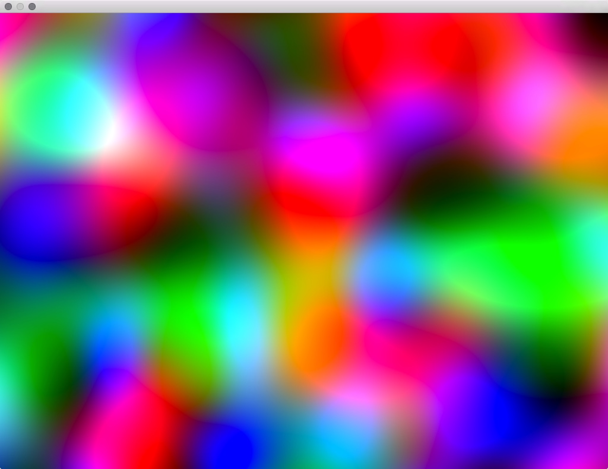

# ofxGLSLSimplexNoise

Generate simplex noise using GLSL(shader). The GLSL code based on ashima's imprimantation. [https://github.com/ashima/webgl-noise](https://github.com/ashima/webgl-noise)

## License

ofxGLSLSimplexNoise is distributed under the MIT License.
